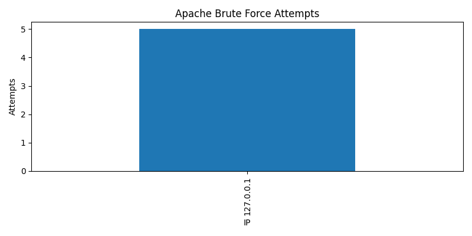
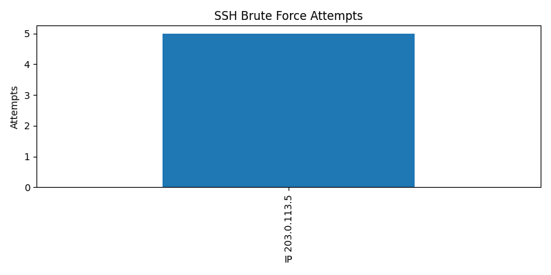
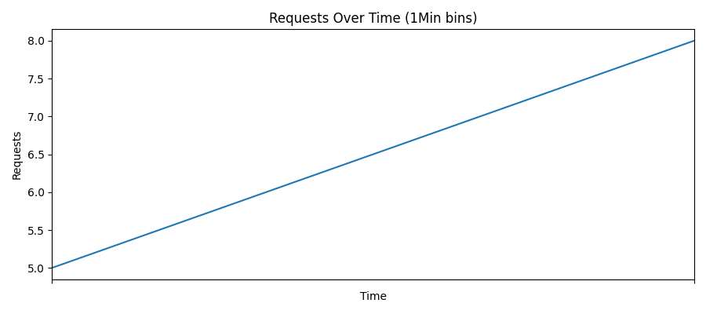

# 🔍 Log File Analyzer for Intrusion Detection

## 📖 Overview
This project analyzes **Apache** and **SSH logs** to detect suspicious activities such as brute-force attacks, port scanning, and denial-of-service (DoS) attempts.  
It generates **structured reports** and **visualizations** to effectively identify intrusion patterns.

---

## 🛠 Tools & Technologies
- **Python** – Core programming language  
- **Pandas** – Data manipulation and analysis  
- **Matplotlib** – Visualization of attack patterns  
- **Regex** – Pattern matching for log parsing  

---

## 📂 Project Structure
- `logs/` : Sample log files  
- `src/` : Python source code  
- `reports/` : Generated reports (CSV, JSON, PNG)  
- `data/` : Processed data files  
- `tests/` : Testing scripts  

---

## 🚀 Progress Timeline

### ✅ Day 1
- Setup project structure (`requirements.txt`, `.gitignore`, README, folders)

### ✅ Day 2
- Added **Apache & SSH log parsing** with sample logs

### ✅ Day 3
- Implemented **threat detection & visualizations**  
  **Threat Detection:**  
  - SSH brute-force attempts (multiple failed logins)  
  - Apache brute-force attempts (multiple 401 responses)  
  - Port scanning (multiple unique endpoints by the same IP)  
  - Possible DoS (high request rate from same IP)  

  **Visualizations:**  
  - Bar charts for Apache & SSH brute-force attempts  

  **Reports:**  
  - CSV: `apache_parsed.csv`, `ssh_parsed.csv`, `bruteforce.csv`, `scanning.csv`, `dos.csv`  
  - JSON: `summary.json`  
  - PNG: `apache_bruteforce.png`, `ssh_bruteforce.png`  

### ✅ Day 4
- Added **visualization charts**:  
  - Top 10 IP addresses (bar chart)  
  - Requests over time (line chart)  
  - Suspicious activity summary charts  
- Reports saved in `reports/`  
- Documentation updated: `docs/PLAN_DAY4.md`, `docs/FLOW_DAY4.md`  

### ✅ Day 5
- Setup **testing framework** (`pytest`)  
- Added **unit tests** for Apache & SSH log parsing  
- Verified detection logic against sample logs  
- Documentation updated: `docs/TESTING_NOTES.md`

  ## 📊 Sample Visualizations  

### Apache Brute Force Attempts
  
*Figure: Apache brute-force detection*

### SSH Brute Force Attempts
  
*Figure: SSH brute-force detection*

### Top 10 IP Addresses
  
*Figure: Top 10 attacking IPs*

### Requests Over Time
  
*Figure: Request patterns showing DoS attempts*

### Suspicious Activity Summary
  
*Figure: Combined suspicious activity overview*

---

## 📌 Next Steps
- [ ] Add PDF export support  
- [ ] Enhance DoS detection with time-based thresholds  
- [ ] Correlate IPs with public blacklists  

---

## 👤 Author
**Blaise Dsilva**  
Cybersecurity Enthusiast | SOC & DFIR Learner  

📌 *Project developed as part of cybersecurity internship tasks.*
