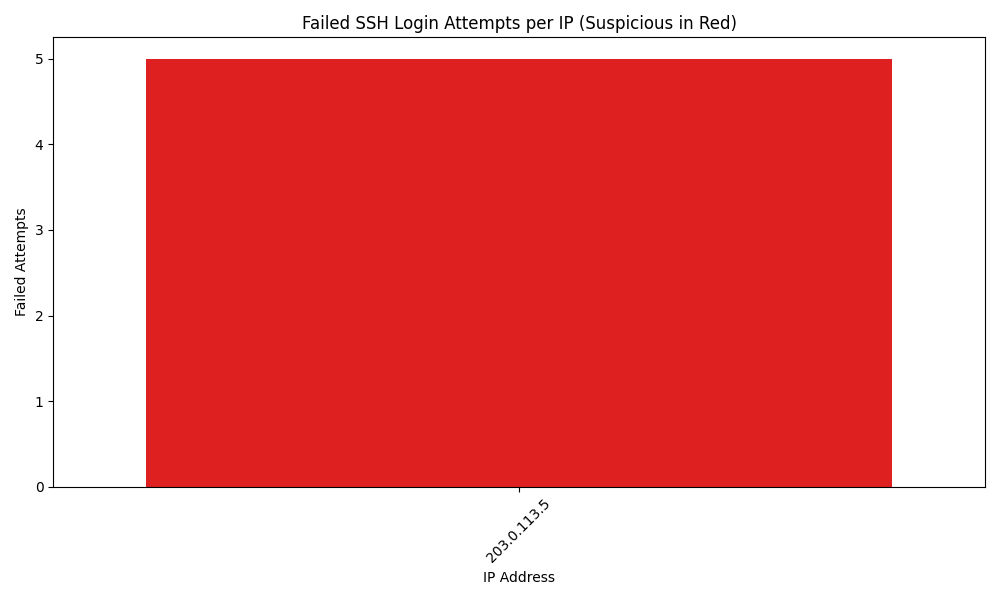
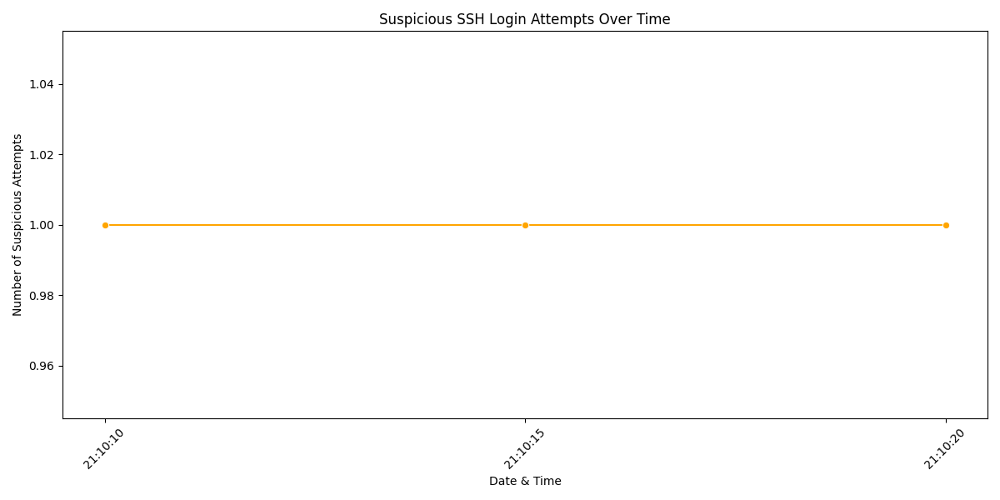
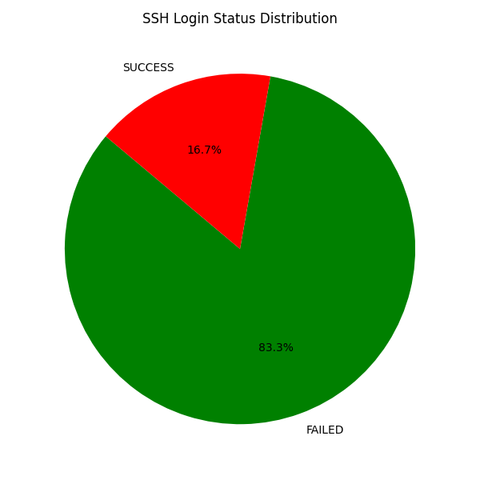

# 🔍 Log File Analyzer for Intrusion Detection

## 📖 Overview
This project analyzes **Apache** and **SSH logs** to detect suspicious activities such as brute-force attacks, port scanning, and denial-of-service (DoS) attempts.  
It generates **structured reports** and **visualizations** to effectively identify intrusion patterns.

## 🛠 Tools & Technologies
- **Python** – Core programming language  
- **Pandas** – Data manipulation and analysis  
- **Matplotlib** – Visualization of attack patterns  
- **Seaborn** – Advanced plotting  
- **Regex** – Pattern matching for log parsing  
- **ReportLab** – PDF report generation  
- **Pytest** – Unit testing framework  

## 📂 Project Structure
- `logs/` : Sample log files  
- `src/` : Python source code  
- `reports/` : Generated reports (CSV, TXT, PDF, PNG)  
- `data/` : Processed data files  
- `tests/` : Unit testing scripts  
- `docs/` : Documentation and planning notes  

## 🚀 Progress Timeline

### ✅ Day 1
- Setup project structure (`requirements.txt`, `.gitignore`, README, folders)

### ✅ Day 2
- Added **Apache & SSH log parsing** with sample logs

### ✅ Day 3
- Implemented **threat detection & visualizations**  
  **Threat Detection:**  
  - SSH brute-force attempts (multiple failed logins)  
  - Apache brute-force attempts (multiple 401 responses)  
  - Port scanning (multiple unique endpoints by the same IP)  
  - Possible DoS (high request rate from same IP)  

  **Reports Generated:**  
  - CSV: `apache_parsed.csv`, `ssh_parsed.csv`, `bruteforce.csv`, `scanning.csv`, `dos.csv`  
  - JSON: `summary.json`  
  - PNG: `apache_bruteforce.png`, `ssh_bruteforce.png`  

### ✅ Day 4
- Added **visualization charts**:  
  - Top 10 IP addresses (bar chart)  
  - Requests over time (line chart)  
  - Suspicious activity summary charts  
- Reports saved in `reports/`  
- Documentation updated: `docs/PLAN_DAY4.md`, `docs/FLOW_DAY4.md`  

### ✅ Day 5
- Setup **testing framework** (`pytest`)  
- Added **unit tests** for Apache & SSH log parsing  
- Verified detection logic against sample logs  
- Documentation updated: `docs/TESTING_NOTES.md`

### ✅ Day 6 
- Wrote **Python script to parse Apache logs**  
- Counted errors, warnings, and access attempts  
- Generated **enhanced CSV report**: `apache_parsed.csv` with columns  

### ✅ Day 7 
- Extended **SSH log parsing**  
  - Detected failed logins and flagged repeated attempts as suspicious  
  - Mapped IP addresses to countries (simplified)  
  - Saved updated CSV report: `ssh_analysis.csv`  
- Added **SSH visualizations**:
  1. **Failed SSH Login Attempts per IP**  
     
  2. **Suspicious SSH Login Attempts Over Time**  
     
  3. **SSH Login Status Distribution (Pie Chart)**  
     

### ✅ Day 8 
- Implemented **Brute Force Detector Module**
  - Analyzed failed login attempts from SSH logs
  - Flagged suspicious IPs with repeated failed logins
  - Generated detailed report: `bruteforce.csv`
  - Created visualization: `bruteforce_top_ips.png`

### ✅ Day 9
- Implemented **scanning attack detection**:
  - Flags IPs hitting many **unique endpoints**
  - Generates **CSV report**: `reports/scanning.csv`
  - Adds **chart**: `reports/scanning_top_ips.png`

### ✅ Day 10
- Implemented **DoS attack detection**:
  - Flags IPs making a high number of requests in a short time window
  - Generates CSV report: `reports/dos.csv`
  - Adds chart: `reports/dos_top_ips.png`

### ✅ Day 11
- **Tested all detection modules** with sample logs
- Verified reports + charts:
  - `bruteforce.csv`, `scanning.csv`, `dos.csv`
  - `bruteforce_top_ips.png`, `scanning_top_ips.png`, `dos_top_ips.png`
- Debugged → modules work as expected

### ✅ Day 12
- Created **visualizations using Matplotlib**:
  - Top IPs for Brute Force, Scanning, DoS
  - Time-based request trends
- Reports saved in `reports/`:
  - `bruteforce_top10_ips_chart.png`
  - `scanning_top10_ips_chart.png`
  - `dos_time_plot.png`

### ✅ Day 13
- Implemented **Incident Report Generation**
  - Exports in **CSV, TXT, and PDF** formats
  - Reports automatically saved inside `reports/` folder
- Verified functionality:  
  ✅ `incident_report.csv`  
  ✅ `incident_report.txt`  
  ✅ `incident_report.pdf`

### ✅ Day 14
- Integrated **IP Blacklist Checking**  
  - Cross-checks suspicious IPs against a known blacklist  
  - Flags blacklisted IPs with reason (e.g., brute-force attacker, port scanner)  
  - Outputs results directly in terminal  
- Verified functionality:  
  ✅ Blacklist detection working with sample IPs  

### ✅ Day 15
- **Tested tool with multiple log samples**:
  - Sample logs tested: `apache_sample.log`, `ssh_sample.log`, `mixed_sample.log`
  - Ran all detection modules: Brute Force, Scanning, and DoS
  - Reports generated and saved in `reports/`:
    - Brute Force: `bruteforce.csv`, `bruteforce_top_ips.png`
    - Scanning: `scanning.csv`, `scanning_top_ips.png`
    - DoS: `dos.csv`, `dos_top_ips.png`
- Verified that modules correctly detect threats across multiple log types
- Tool runs successfully on batch log files using bash loop

### ✅ Day 16
- Optimized codebase for better readability and maintainability  
- Added clear **inline comments** explaining parsing, detection, and visualization logic  
- Restructured scripts to be **modular**:
  - Wrapped logic inside functions (`main()`, `detect_bruteforce()`, etc.)
  - Moved repeated logic into reusable functions  
- Cleaned unused imports and redundant code  
- Verified all detection modules still run correctly after cleanup

## 📊 Sample Visualizations  

### Apache Brute Force Attempts
  

### SSH Brute Force Attempts
  

### Top 10 IP Addresses
  

### Requests Over Time
  

### Suspicious Activity Summary
  

## 📌 Next Steps
- [ ] Enhance DoS detection with advanced thresholds  
- [ ] Correlate IPs with public blacklists  
- [ ] Add interactive dashboards (future scope)  

## 👤 Author
**Blaise Dsilva**  
Cybersecurity Enthusiast | SOC & DFIR Learner  

📌 *Project developed as part of cybersecurity internship tasks.*
